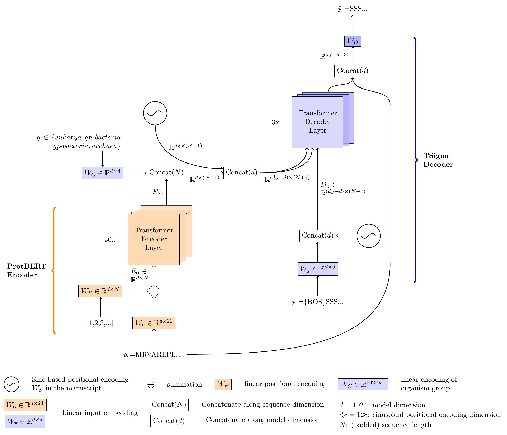

# TSignal

TSignal is a deep architecture for Signal Peptide (SP) and cleavage site (CS) prediction inspired by the popular sequence translator model introduced in "Attention is all you need" [1]. We introduce the first unstructured predictor model in this field and provide extensive analysis to visualize its advantages over the structured counterparts. Our model takes advantage of the powerful encoder-decoder architecture of the original transformer natural language translator, to which we incorporate various task-specific additions, to help the model learn in our small data setting. Our model uses transfer learning with pre-trained weights from [4]. For detailed explanations of the architecture, our preprint is now available at [*TSignal: A transformer model for signal peptide prediction*](https://www.biorxiv.org/content/10.1101/2022.06.02.493958v1) [2].

## 1 Installation

Please install Python 3.7.7. Other versions are not guaranteed to work.

### 1.1 Required packages

Use pip install -r requirements.txt

## 2 Data

**Necessary for reproducing the main results:** We use data from [3]. Add the necessary training
binaries directly from [Link to CV files](https://www.dropbox.com/scl/fo/h3dyfr358optb7to5n9ma/h?dl=0&rlkey=iwvnr6bcklhtogiz9t3pterir) or download from [SignalP 6.0](https://services.healthtech.dtu.dk/service.php?SignalP-6.0) 
the train_set.fasta file "SignalP 6.0 Training set" and add it to sp_data/sp6_data/ folder (in the latter case, the cross-validation binaries should automatically be created). In either case, please properly cite the authors of the homology-split data. The benchmark data on which we
report the results is found in "SignalP 5.0 Benchmark set", which can be found in the data section at the same link [SignalP 6.0](https://services.healthtech.dtu.dk/service.php?SignalP-6.0) (also add it to sp_data/). Note that results will be predicted for the whole homology-partitioned data, and the benchmark SignalP 5.0 data 
will just specify which of those sequences to be accounted for in the final resultsbut in the functions of misc/visualization.py, it will be used to report performance on this data if specified so (to compare
against SignalP 6.0 results reported in their manuscript for instance, do set benchmark=True).

The model should automatically set up binaries "sp6_partitioned_data_<test/train>_<fold_no>.bin" in sp_data folder based 
on the downloaded fasta file (which should also be in sp_data folder) the first time a model is trained.
  

## 3 Usage

ProtBERT will automatically be downloaded to sp_data/models folder when training with <tune_bert> parameter set to true.

The base fasta file needs to be in the correct folder for training (refer to Section 2).

### 3.1 Predict on your own sequences

Download our pre-trained model from [here](https://www.dropbox.com/s/lfuleg9470s7nqx/deployment_sep_pe_swa_extra_inpemb_on_gen_best_eval_only_dec.pth?dl=0) and add it in sp_data folder. Then, add the file containing the test sequences (fasta or binary format) in the sp_data folder.

The fasta or binary format files need to be provided via the argument "--test_files <test_file>" (see Example 1 in example_runs.txt): fasta and binary formats. If a fasta file is given as argument, a corresponding binary file will automatically be created and added in the same folder (sp_data/).

If a binary file is given to --test_files, a dictionary of the form {sequence:[embedding, label_sequence, life_group, sp-type]} will be required. Since it is used for testing, all entries may be random, and the binaries are created this way for compatibility with training datasets. Refer to "sp_data/test_seqs.bin" as an example binary test file.

To extract saliency maps of some sequences: follow the same procedures as in extracting predictions, and simply add "--compute_saliency" argument to your call.

### 3.2  Test the performance of the model

- **Necessary for reproducing the main results:**: To re-create a similar experiment on SignalP 6.0 data, 3 different runs are needed (refer to example 2 from
example_runs.txt and its comments). At the end, plot_sp6_vs_tnmt and plot_sp6_vs_tnmt_mcc methods from misc/visualize_cs_pred_results.py 
may be used for CS-F1 and MCC1/2. Note that all predictions from all runs have to be in a folder <fld_name> containing <run_name>\_<fold_i>_<fold_j> files, followed by various exntesions
  (including but not limited to):
  -  _best_sptype.bin 
  - _best.bin
  - .log 
  In general, it should be enough to do cp run_name* /\<path>/\<to>/misc/<fld_name>, after running for each fold pair 0,1/0,2/1,2

- If a different dataset needs to be tested, refer to the 3.4 to create your own sequence file. After predicting the 
sequences, use the correct and true predictions with misc/visualize_cs_pred_results.py methods get_pred_perf_sptype and get_cs_perf
to get the SP type/CS performance on your predictions.

### 3.3  Train a new model while tuning bert
Recreating a deployment model: First, follow the instructions on Section 2. If you wish to replicate the experiment results, refer to arguments --train_folds 
from main.py. If you wish to create another deployment model, trained on (D1,train, D2,train, 
D3,train; validated on (D1,test, D2,test, D3,test) refer to --deployment_model 
argument in main.py.

### 3.4  Train a new model <u>while not tuning bert</u>

Currently, a non-tuning-ProtBERT model only works with global label predictions. Therefore, use_glbl_lbls needs to be 
true and glbl_lbl_version to the desired SP type prediction approach. Additionally, for efficiency reasons, when not 
tuning the ProtBERT model, the embeddings for a dataset are pre-computed. When not calling main.py with --tune_bert, 
these will be automatically computed for SignaP 6.0 data and the load will starts from there.

### 3.5  Test on your own sequences

If you want to test the model on your own sequences, please refer to create_test_files.py script, method for the method
create_test_file(). If you want to use our pre-trained model, refer to Example 1 in example_runs.txt. To also create a 
saliency map for the predictions, add --compute_saliency to the example 1.

## References 
[1] Vaswani, A. et al. (2017). Attention is All you Need. In I. Guyon,
U. V. Luxburg, S. Bengio, H. Wallach, R. Fergus, S. Vishwanathan,
and R. Garnett, editors, Advances in Neural Information Processing
Systems, volume 30. Curran Associates, Inc.

[2] Dumitrescu, A. et al. (*submitted in* 2022). TSignal: A transformer model for signal peptide prediction.  

[3] Teufel, F. et al. (2022). SignalP 6.0 predicts all five types of signal peptides
using protein language models. Nature Biotechnology.

[4] Elnaggar, A. et al. (2021). ProtTrans: Towards Cracking the Language
of Lifes Code Through Self-Supervised Deep Learning and High
Performance Computing. IEEE Transactions on Pattern Analysis and
Machine Intelligence, pages 1–1.